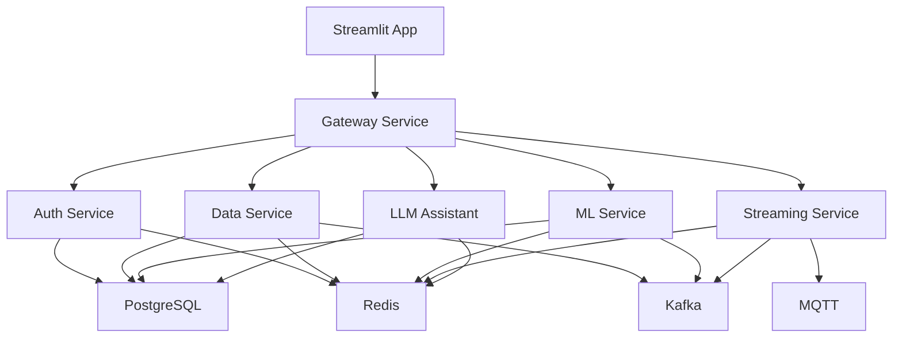

# SIMS Deployment Guide

## Overview

This guide covers deploying the Smart Infrastructure Monitoring System (SIMS) in various environments.

## Architecture

SIMS is built with a microservices architecture:

### Core Services
- **Auth Service** (Port 8001): OAuth2/JWT authentication
- **Data Service** (Port 8002): REST API for data operations
- **ML Service** (Port 8003): Machine learning and AI operations
- **Streaming Service** (Port 8004): Real-time data streaming (Kafka/MQTT)
- **Gateway Service** (Port 8000): API Gateway and load balancer
- **LLM Assistant** (Port 8005): AI-powered chatbot assistant
- **Streamlit App** (Port 5000): Web frontend

### Infrastructure Components
- **PostgreSQL**: Primary database
- **Redis**: Caching and session storage
- **Apache Kafka**: Message streaming
- **MQTT**: IoT device communication
- **Prometheus**: Metrics collection
- **Grafana**: Monitoring dashboards

## Quick Start

### Local Development (Docker Compose)

```bash
# Build and start all services
docker-compose -f deployment/docker-compose.yml up -d

# Check service health
curl http://localhost:8000/gateway/health

# Access the application
open http://localhost:5000
```

### Production Deployment (Kubernetes)

```bash
# Deploy to Kubernetes
kubectl apply -f deployment/kubernetes/

# Check deployment status
kubectl get pods -n sims

# Port forward for local access
kubectl port-forward svc/gateway-service 8000:8000 -n sims
```

### Cloud Deployment (AWS)

```bash
# Deploy infrastructure with Terraform
cd deployment/cloud/aws/terraform
terraform init
terraform plan
terraform apply

# Deploy application
./deployment/scripts/build-and-deploy.sh production us-west-2
```

## Environment Variables

### Required for All Services
- `DATABASE_URL`: PostgreSQL connection string
- `REDIS_HOST`: Redis server hostname
- `JWT_SECRET_KEY`: Secret key for JWT tokens

### Service-Specific
- `KAFKA_BOOTSTRAP_SERVERS`: Kafka broker addresses
- `MQTT_BROKER`: MQTT broker hostname
- `OPENAI_API_KEY`: OpenAI API key (optional)

## Service Dependencies



## Monitoring

### Prometheus Metrics
- Service health and performance
- Resource utilization
- Custom business metrics

### Grafana Dashboards
- System overview
- Service performance
- Infrastructure metrics
- Business intelligence

### Health Checks
All services expose `/health` endpoints for monitoring.

## Security

### Authentication
- JWT-based authentication
- Role-based access control
- Session management with Redis

### Network Security
- Service-to-service communication
- API rate limiting
- CORS configuration

### Data Protection
- Encrypted data at rest
- Secure communication channels
- Audit logging

## Scaling

### Horizontal Scaling
- Load balancing with Gateway Service
- Multiple service instances
- Database read replicas

### Auto Scaling
- Kubernetes HPA (Horizontal Pod Autoscaler)
- AWS ECS Auto Scaling
- Custom metrics-based scaling

## Backup and Recovery

### Database Backups
- Automated PostgreSQL backups
- Point-in-time recovery
- Cross-region replication

### Configuration Backups
- Infrastructure as Code (Terraform)
- Kubernetes manifests
- Docker configurations

## Troubleshooting

### Common Issues

1. **Service Not Starting**
   - Check logs: `docker logs <container_name>`
   - Verify environment variables
   - Check database connectivity

2. **Database Connection Issues**
   - Verify DATABASE_URL format
   - Check network connectivity
   - Confirm credentials

3. **Authentication Failures**
   - Check JWT_SECRET_KEY configuration
   - Verify Redis connectivity
   - Review user permissions

### Debug Commands

```bash
# Check service logs
kubectl logs -f deployment/auth-service -n sims

# Execute into container
kubectl exec -it deployment/auth-service -n sims -- /bin/bash

# Check service health
curl http://localhost:8000/gateway/health

# Database connection test
python -c "from utils.database import engine; print(engine.execute('SELECT 1').scalar())"
```

## Performance Optimization

### Database Optimization
- Connection pooling
- Query optimization
- Index management

### Caching Strategy
- Redis for session data
- Application-level caching
- CDN for static assets

### Resource Management
- CPU and memory limits
- Connection limits
- Queue management

## Maintenance

### Regular Tasks
- Database maintenance
- Log rotation
- Security updates
- Performance monitoring

### Upgrade Process
1. Test in staging environment
2. Backup current configuration
3. Rolling deployment
4. Verify functionality
5. Monitor performance

## Support

### Documentation
- API documentation: `/docs` endpoint
- Service documentation: Individual README files
- Architecture diagrams: `docs/` directory

### Logging
- Centralized logging with CloudWatch/ELK
- Structured logging format
- Log retention policies

### Monitoring
- Real-time alerts
- Performance dashboards
- Error tracking

## License

This project is licensed under the MIT License - see the LICENSE file for details.